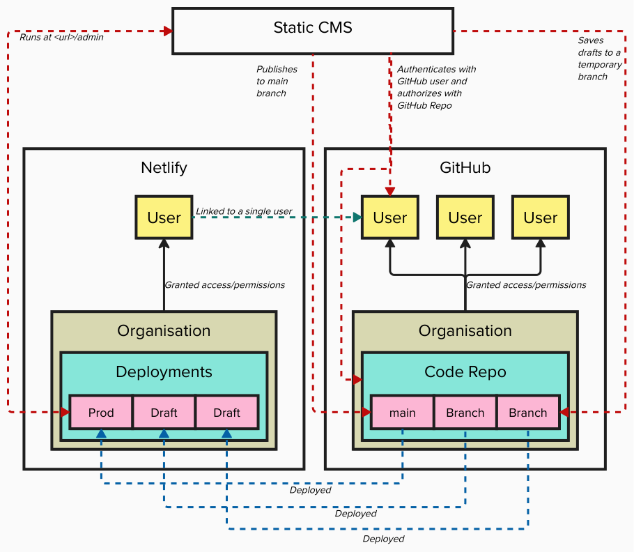

# Architecture 

## Code Parts

- [**11ty**](https://www.11ty.dev/): A JavaScript and Markdown based platform that generates static websites.
- [**Static CMS**](https://www.staticcms.org/): A content management systems that can read, write, and publish changes to a GitHub repository. It does not require an application server, but runs as a single page application hosted at the `/admin` endpoint. It uses GitHub as an authentication and authorization mechanism.

## Infrastructure 

- [**GitHub**](https://github.com/): Store the application's code and is used to authenticate/authorize contributors.
- [**Netlify**](https://www.netlify.com/): Hosts the application, including drafts and production deployments. Has a single user (but could have more if configured) that is linked to a GitHub account for access to the repository.

## Publish Workflow

1. User goes to `<url>/admin` to access Static CMS
1. Static CMS asks user to authenticate with their GitHub user account, which also checks the repository for read/write authorization
1. User add, deletes, or modifies a piece of content in Static CMS
1. Static CMS saves the draft in a GitHub branch
1. Netlify sees the draft and deploys it
1. User can preview the draft at a draft URL
1. User publishes the content
1. Static CMS saves the published content in the main branch
1. Netlify sees the published content and deploys it to the hosting behind `<url>`

## Maintenance Notes

### CMS Branching

Right now, Static CMS does not create a branch as diagrammed and instead just stores changes on the editor's computer until publishing. However, this feature is coming soon and can be upgraded in the future to do this. This will better enable previewing content before publishing.

When that time comes, the version number in `@staticcms/app@^3.3.0` can be updated in [`src/admin/index.html][/src/admin/index.html].